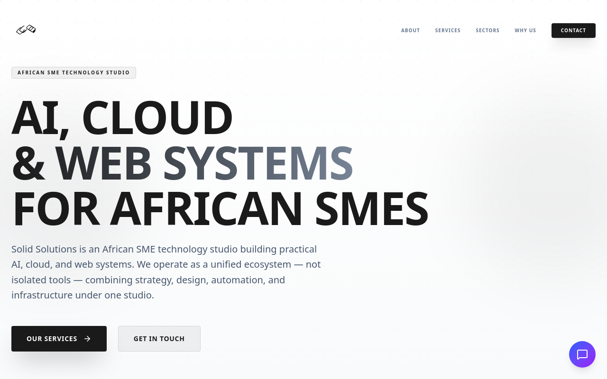

# Solid Solutions

[](https://solidsolutions.africa)
[](LICENSE)
[](package.json)
[](.github/workflows/main.yml)
[](https://github.com/YassinAliYassin/solidsolutions.africa/actions/workflows/ci.yml)

**African SME technology studio** — practical AI, cloud, and web systems for small and medium enterprises across Africa.



| | |
|---|---|
| **Live site** | [solidsolutions.africa](https://solidsolutions.africa) |
| **Location** | Harare, Zimbabwe |
| **Contact** | [info@solidsolutions.africa](mailto:info@solidsolutions.africa) |
| **Telegram** | [@solidsolutions](https://t.me/solidsolutions) |

---

## About

Solid Solutions is a unified technology studio — not a collection of isolated tools. We combine strategy, design, automation, and infrastructure to help African SMEs look credible online, respond faster, and run cleaner operations.

**Core offerings:**

- **Web & brand presence** — fast, professional sites for SMEs, founders, NGOs, and service businesses
- **SolidAI** — sector-specific AI agents for agriculture, health, education, finance, legal, transport, energy, and retail
- **Solid Cloud** — managed workspaces and infrastructure for small teams
- **AionUI** — desktop and Telegram-connected command layer for agents and workflows

---

## Site routes

| Path | Page |
|------|------|
| `/` | Home — services, sectors, roadmap, contact |
| `/solid-llm` | SolidAI product overview |
| `/solid-llm/about` | SolidAI about |
| `/solidai` | SolidAI platform |
| `/solidai/docs` | SolidAI documentation |
| `/documentation` | General documentation |
| `/beta` | Developer beta access |
| `/gallery` | Picture gallery |
| `/coming-soon` | Coming soon |

---

## Tech stack

| Layer | Technology |
|-------|------------|
| Framework | React 19 + TypeScript |
| Build | Vite 8 |
| Styling | Tailwind CSS 4 |
| Routing | React Router 7 (lazy-loaded routes) |
| Animation | Motion, Lenis smooth scroll |
| Icons | Lucide React, Font Awesome |
| Chat widget | Rule-based assistant (OpenRouter integration planned) |
| Hosting | cPanel via SFTP, GitHub Actions CI/CD |

---

## Local development

**Prerequisites:** Node.js 22+

```bash
# HTTPS
git clone https://github.com/YassinAliYassin/solidsolutions.africa.git
cd solidsolutions.africa

# or SSH
git clone git@github.com:YassinAliYassin/solidsolutions.africa.git
cd solidsolutions.africa

npm install
cp .env.example .env.local   # optional
npm run dev                    # http://localhost:3000
```

### Scripts

| Command | Description |
|---------|-------------|
| `npm run dev` | Start Vite dev server on port 3000 |
| `npm run build` | Production build → `dist/` |
| `npm run preview` | Preview the production build locally |
| `npm run lint` | TypeScript type check (`tsc --noEmit`) |
| `npm run clean` | Remove `dist/` |

---

## Environment variables

Copy `.env.example` to `.env.local` for local development:

```env
GEMINI_API_KEY=your_gemini_api_key    # Reserved for future AI integrations
APP_URL=https://solidsolutions.africa # Self-referential links and metadata
```

The site runs without these values. The on-site chat widget currently uses built-in rule-based responses.

---

## Deployment

Pushes to `main` trigger the **Auto Deploy** GitHub Actions workflow:

1. `npm ci` → `npm run build`
2. Upload `dist/` to cPanel via **rsync over SSH**
3. Post-deploy health check against the live domain

### Required GitHub secrets

| Secret | Purpose |
|--------|---------|
| `SSH_PRIVATE_KEY` | Deploy key for `solidsol@zacp111.webway.host` (public key must be in cPanel → SSH Access) |
| `GEMINI_API_KEY` | Build-time env injection (reserved for future AI features) |

### Manual deploy (local)

```bash
npm run build
SSH_PRIVATE_KEY=~/.ssh/solid_solutions_deploy ./scripts/deploy.sh
```

### Manual deploy trigger

```bash
gh workflow run "Auto Deploy" --repo YassinAliYassin/solidsolutions.africa
```

**Branches:**

- `main` — source code (canonical)
- `gh-pages` — static mirror for GitHub Pages

Production traffic is served from cPanel at [solidsolutions.africa](https://solidsolutions.africa).

---

## Project structure

```
solidsolutions.africa/
├── src/
│   ├── pages/          # Route-level page components
│   ├── components/     # Shared UI (Footer, ChatBot, Logo, …)
│   ├── App.tsx         # Router and lazy route definitions
│   └── index.css       # Global styles and Tailwind imports
├── public/             # Static assets (images, .htaccess)
├── scripts/            # Maintainer utilities (screenshot capture)
├── prisma/             # Prisma schema (SQLite, future CMS use)
├── .github/
│   ├── workflows/      # CI (lint + build) and Auto Deploy
│   ├── ISSUE_TEMPLATE/ # Bug report and feature request forms
│   └── dependabot.yml  # Weekly dependency update PRs
├── CONTRIBUTING.md
├── SECURITY.md
└── vite.config.ts      # Vite config with manual chunk splitting
```

---

## Repository

This is the **canonical** repository for the Solid Solutions public website.

- **GitHub:** [github.com/YassinAliYassin/solidsolutions.africa](https://github.com/YassinAliYassin/solidsolutions.africa)
- **Clone (SSH):** `git@github.com:YassinAliYassin/solidsolutions.africa.git`
- **Clone (HTTPS):** `https://github.com/YassinAliYassin/solidsolutions.africa.git`

---

## Contributing

Contributions are welcome — bug fixes, copy improvements, accessibility tweaks, performance work, and new pages or components that fit the Solid Solutions brand.

See **[CONTRIBUTING.md](CONTRIBUTING.md)** for the full guide: setup, branch workflow, code conventions, PR checklist, and issue reporting.

Use the [bug report](.github/ISSUE_TEMPLATE/bug_report.yml) or [feature request](.github/ISSUE_TEMPLATE/feature_request.yml) templates when opening issues. Pull requests use the [PR template](.github/pull_request_template.md) automatically.

Report security issues via [SECURITY.md](SECURITY.md) — not public issues.

---

## License

MIT © 2026 [Yassin Ali](https://github.com/YassinAliYassin)